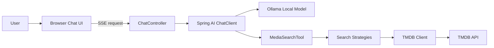

# 🎬 Movie-Agent

<div align="center">

**AI-powered movie discovery with Spring Boot, Spring AI, Ollama, and TMDB**

[](https://openjdk.org/)
[](https://spring.io/projects/spring-boot)
[](https://spring.io/projects/spring-ai)
[](https://ollama.com/)
[](https://www.themoviedb.org/documentation/api)
[](https://docs.spring.io/spring-framework/reference/web/webflux.html)

</div>

Movie-Agent is a reactive Spring Boot application that combines a **local LLM running on Ollama** with **The Movie Database (TMDB)** to create a chat-first movie assistant.

It offers a polished browser chat UI, real-time streamed answers through **Server-Sent Events (SSE)**, and direct TMDB-backed endpoints for movies, TV shows, and people search.

---

## ✨ Highlights

- **Chat-first movie assistant** powered by Spring AI + Ollama
- **Real-time streaming responses** with SSE for a smoother UX
- **TMDB integration** for movies, TV shows, people, and keywords
- **Unified search tool** with strategy-based routing by media type
- **Reactive stack** built on Spring WebFlux
- **Developer-friendly setup** using `.env`-based local configuration
- **Operational health endpoint** for smoke checks and uptime probes
- **External API passthrough endpoints** for direct TMDB verification

---

## 🧠 What the app does

Movie-Agent lets you ask natural-language questions such as:

- *"Find top-rated Matrix movies"*
- *"Show me TV shows similar to Breaking Bad"*
- *"Search for Tom Hanks"*
- *"Help me discover movies from 1999"*

Under the hood, the assistant can use a unified `mediaSearchTool` that routes searches to TMDB strategies for:

- `movie`
- `tv`
- `person`
- `keyword`
- `auto`

The `auto` mode aggregates results across multiple TMDB search endpoints.

---

## 🏗️ Architecture



### Main building blocks

- **UI layer**: Thymeleaf page at `/` with Tailwind-based chat interface
- **Streaming layer**: SSE endpoint at `/chat/stream`
- **AI layer**: Spring AI `ChatClient` configured with a system prompt and tool access
- **Integration layer**: reactive `TmdbClient` using `WebClient`
- **Search orchestration**: strategy pattern for movie, TV, person, keyword, and auto search

---

## 🛠️ Tech stack

- **Java 25**
- **Spring Boot 4.1.1**
- **Spring AI 2.0.1**
- **Spring WebFlux**
- **Thymeleaf**
- **Ollama** for local LLM inference
- **TMDB API** for movie metadata
- **Maven Wrapper** for build and test execution

---

## 📁 Project structure

```text
src/
├── main/
│   ├── java/com/michelenuovo/movieagent/
│   │   ├── client/tmdb/        # Reactive TMDB client
│   │   ├── config/             # Spring configuration
│   │   ├── controller/         # MVC + REST endpoints
│   │   ├── dto/                # Request/response models
│   │   ├── properties/         # Strongly typed configuration
│   │   └── tool/               # Spring AI tools, mappers, strategies
│   └── resources/
│       ├── application.yaml    # App configuration
│       └── templates/chat.html # Browser chat UI
└── test/                       # Unit, smoke, and external tests
```

---

## 🚀 Getting started

### Prerequisites

Before running the app, make sure you have:

- **Java 25** installed
- **Ollama** installed and running locally
- A **TMDB API Read Access Token** or **TMDB API key**
- Internet access to reach TMDB

### 1. Clone the repository

```bash
git clone <your-repository-url>
cd movie-agent
```

### 2. Prepare local environment variables

Copy the provided example file:

```bash
cp .env.example .env
```

Then update `.env` with your real values:

```dotenv
TMDB_READ_ACCESS_TOKEN=your_tmdb_read_access_token
TMDB_API_KEY=your_tmdb_api_key_optional
TMDB_TRUST_STORE_PATH=/absolute/path/to/tmdb-truststore.p12
TMDB_TRUST_STORE_PASSWORD=changeit
TMDB_TRUST_STORE_TYPE=PKCS12
```

> `TMDB_READ_ACCESS_TOKEN` is the preferred authentication method. If both token and API key are set, the bearer token takes precedence.

### 3. Start Ollama

If needed, pull the default model configured by the app:

```bash
ollama pull llama3.1:8b
ollama serve
```

By default, the application expects Ollama at:

```text
http://localhost:11434
```

### 4. Run the application

Using the Maven Wrapper:

```bash
./mvnw spring-boot:run
```

The application will start on the default Spring Boot port:

```text
http://localhost:8080
```

---

## ⚙️ Configuration

The main runtime configuration lives in `src/main/resources/application.yaml`.

### Default application settings

| Property                        | Default                        | Purpose                        |
|---------------------------------|--------------------------------|--------------------------------|
| `spring.application.name`       | `movie-agent`                  | Spring application name        |
| `spring.ai.ollama.base-url`     | `http://localhost:11434`       | Ollama server URL              |
| `spring.ai.ollama.chat.model`   | `llama3.1:8b`                  | Default local chat model       |
| `tmdb.api.base-url`             | `https://api.themoviedb.org/3` | TMDB base API URL              |
| `tmdb.api.read-access-token`    | env-based                      | Preferred TMDB bearer auth     |
| `tmdb.api.api-key`              | env-based                      | Optional TMDB v3 fallback auth |
| `tmdb.api.trust-store-path`     | env-based                      | Optional custom trust store    |
| `tmdb.api.trust-store-password` | env-based                      | Trust store password           |
| `tmdb.api.trust-store-type`     | `PKCS12`                       | Trust store type               |

### Notes

- Local secrets are loaded from an optional project-root `.env` file.
- Trust store settings are useful behind corporate proxies or custom TLS inspection setups.
- If no TMDB credential is configured, TMDB-backed operations fail fast.

---

## 🖥️ Usage

### Open the chat UI

Visit:

```text
http://localhost:8080/
```

You will get a browser-based chat interface that streams the assistant reply as it is generated.

### Example prompts

- `Find top rated Matrix movies`
- `Show me popular sci-fi TV shows`
- `Search for Christopher Nolan movies`
- `Who is Tom Hanks?`

---

## 🔌 API endpoints

### Health

```http
GET /health
```

Response:

```json
{
  "status": "UP"
}
```

### Stream AI responses

```http
GET /chat/stream?message=Find%20top%20rated%20Matrix%20movies
Accept: text/event-stream
```

Returns SSE text chunks suitable for browser streaming.

### Search movies

```http
POST /chat/search
Content-Type: application/json
```

Example body:

```json
{
  "query": "The Matrix",
  "include_adult": false,
  "language": "en-US",
  "page": 1,
  "primary_release_year": "1999",
  "region": "US",
  "year": "1999"
}
```

### Search TV shows

```http
POST /chat/search/tv
Content-Type: application/json
```

Example body:

```json
{
  "query": "Breaking Bad",
  "include_adult": false,
  "language": "en-US",
  "page": 1,
  "first_air_date_year": 2008,
  "year": 2008
}
```

### Search people

```http
POST /chat/search/person
Content-Type: application/json
```

Example body:

```json
{
  "query": "Tom Hanks",
  "include_adult": false,
  "language": "en-US",
  "page": 1
}
```

### TMDB movie details by ID

```http
GET /tmdb/movie/{movieId}
```

Example:

```http
GET /tmdb/movie/11
```

### TMDB TV details by ID

```http
GET /tmdb/tv/{tvId}
```

Example:

```http
GET /tmdb/tv/1396
```

> The direct TMDB detail endpoints proxy upstream TMDB payloads and preserve upstream error status codes for easier debugging.

---

## 🧪 Testing

### Run the standard test suite

```bash
./mvnw test
```

### Run external integration tests

Some tests are intentionally guarded and only run when explicitly enabled:

```bash
RUN_EXTERNAL_TESTS=true ./mvnw test
```

These external tests rely on working TMDB credentials and network access.

### Existing test coverage includes

- application context loading
- media search tool routing
- health endpoint smoke testing
- TMDB auth-mode behavior
- TMDB trust store handling
- TMDB external connectivity and endpoint checks

---

## 📬 Handy local checks

This repository already includes `http-requests.http` for IntelliJ HTTP Client testing.

You can use it to quickly verify:

- health endpoint
- chat streaming endpoint
- typed movie search requests
- TMDB lookup endpoints

---

## 🌟 Why this repository stands out

- Clear separation between **UI**, **AI orchestration**, **tooling**, and **external API integration**
- A practical example of **Spring AI tool calling** against real-world data
- Fully local LLM setup through **Ollama**, avoiding mandatory cloud model dependencies
- Reactive implementation with streaming UX and production-friendly health checks
- Clean foundation for extending into recommendations, watchlists, similarity search, or RAG-style movie assistants

---

## 🔮 Possible next improvements

If you want to make the repository even stronger, good next additions would be:

- screenshots or a short demo GIF in the README
- GitHub Actions CI badge and workflow
- Docker / Docker Compose setup
- API documentation with OpenAPI or SpringDoc
- persistent chat history
- recommendation memory and user profiles
- observability with metrics and structured logs

---

## 🤝 Contributing

Contributions, refactors, and feature ideas are welcome.

A good contribution flow is:

1. Fork the repository
2. Create a feature branch
3. Make your changes
4. Run the tests
5. Open a pull request with a clear description

---

## 📝 License

This repository does not currently include a license file.
If you plan to share it publicly, adding a `LICENSE` file is strongly recommended.

---

## 🙏 Acknowledgements

- [Spring Boot](https://spring.io/projects/spring-boot)
- [Spring AI](https://spring.io/projects/spring-ai)
- [Ollama](https://ollama.com/)
- [TMDB](https://www.themoviedb.org/)

> This product uses the TMDB API but is not endorsed or certified by TMDB.

